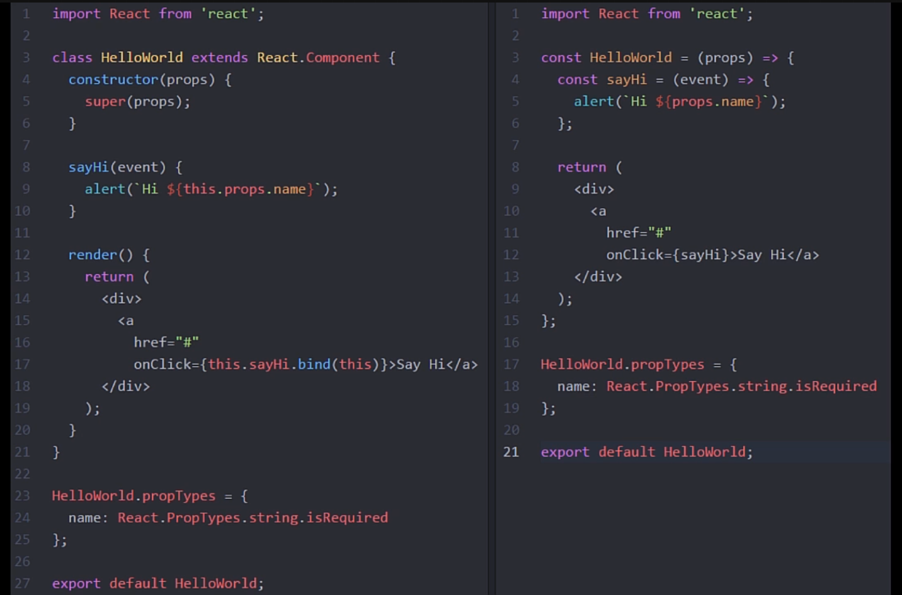
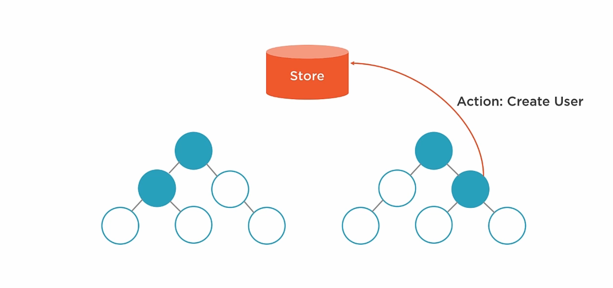
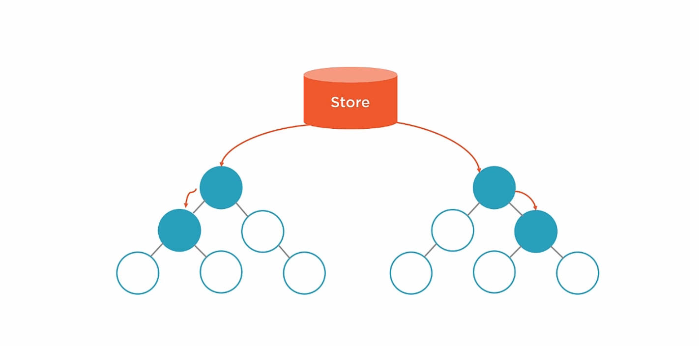
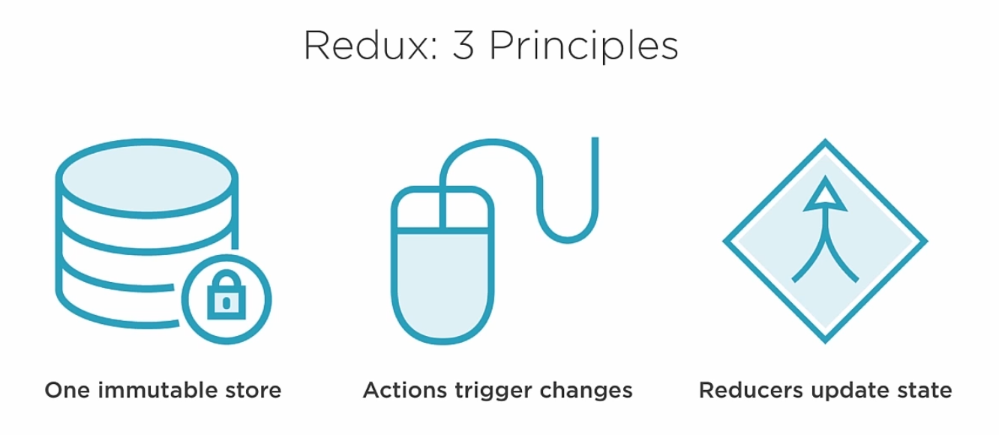
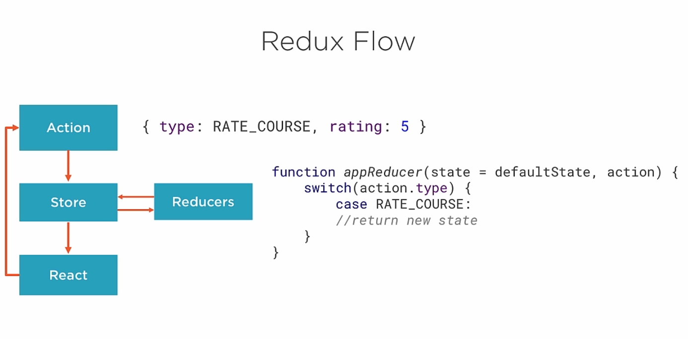
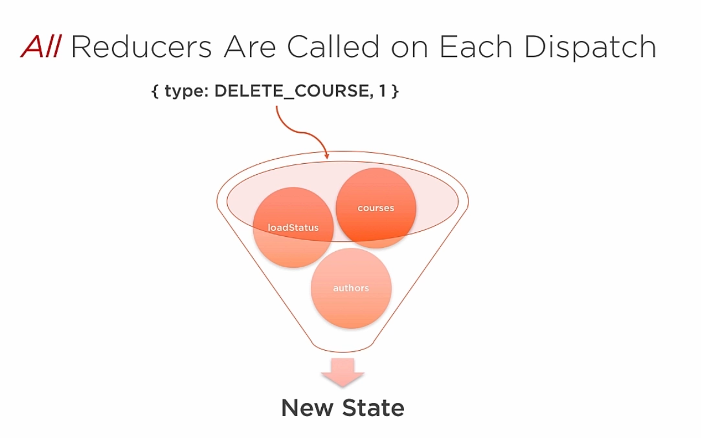
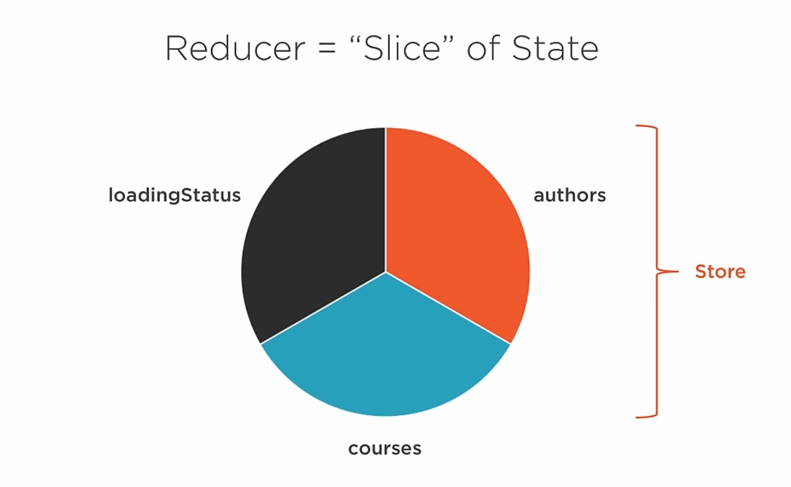
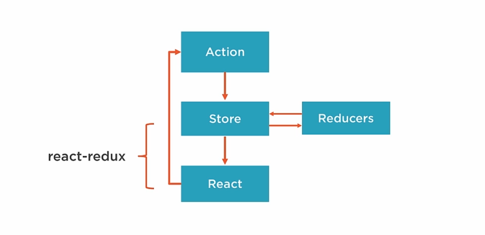

# Building Applications With React and Redux in ES6

## Introduction

### Why Redux

- de facto standard in the React community
- creator has joined fb group
- fb uses itself

### Framework specific reasons

- **one store**: all state is store in one object
- **reduced boilerplate**
- **isomorphic/universal** friendly
- **immutable store**
- **hot reloading**: reload a module without losing state
- **time-travel debugging**: step forward and backward through state changes in your code
- **small api**: only 2k gzipped

## Environment Setup

**What we want to achieve**
- automated Testing
- linting
- minification
- bundling
- jsx compilation
- es6 transpilation
- all with one command

### Babel

Babel transpiles es6 to es5.
Babel-polyfill polyfills all features that cant be transpiled.
**It's better to polyfill specific features**

### Webpack

Handles minification and bundling of our javascript.

### Mocha

The most used js testing framework.

### Eslint

Lint our JS and help us enforce best practices.

### Used versions for this course

- react 15.0.2
- redux 3.5.2
- react/router 2.4.0
- webpack 1.13
- babel 6.*

### Hot Reloading

**babel-preset-react-hmre** package enables hot-reloading. This package wraps a number of other libraries and settings in a single file.
Works by wrapping your components in a proxy via babel. The proxies are classes that act just like your classes but provide hooks for new implementation.
Changes are immediately applied when file is saved, without any reloading.

**Warning**
- experimental
- doesn't reload functional components (unless there a class wrapping the component, that's why we'll use classes at the top level even though there are functional components)
- doesn't reload container functions like mapStateToProps
- other options exist


### Node

We'll need node. Use nvm if you don't have the proper version.

### Our package.json

- we'll use the [pluralsight-redux-starter](https://github.com/coryhouse/pluralsight-redux-starter) repo as a guideline
- information about packages used can be fount on that link
- we'll build it ourself to understand the process more

> copy contenst of package.json to our local package.json or copy the code below

```javascript
{
  "name": "building-applications-with-react-and-redux-in-es6",
  "version": "1.0.0",
  "description": "",
  "main": "index.js",
  "directories": {
    "doc": "docs"
  },
  
  "author": "",
  "license": "ISC",

  "dependencies": {
    "babel-polyfill": "6.8.0",
    "bootstrap": "3.3.6",
    "jquery": "2.2.3",
    "react": "15.0.2",
    "react-dom": "15.0.2",
    "react-redux": "4.4.5",
    "react-router": "2.4.0",
    "react-router-redux": "4.0.4",
    "redux": "3.5.2",
    "redux-thunk": "2.0.1",
    "toastr": "2.1.2"
  },

  "devDependencies": {
    "babel-cli": "6.8.0",
    "babel-core": "6.8.0",
    "babel-loader": "6.2.4",
    "babel-plugin-react-display-name": "2.0.0",
    "babel-preset-es2015": "6.6.0",
    "babel-preset-react": "6.5.0",
    "babel-preset-react-hmre": "1.1.1",
    "babel-register": "6.8.0",
    "colors": "1.1.2",
    "compression": "1.6.1",
    "cross-env": "1.0.7",
    "css-loader": "0.23.1",
    "enzyme": "2.2.0",
    "eslint": "2.9.0",
    "eslint-plugin-import": "1.6.1",
    "eslint-plugin-react": "5.0.1",
    "eslint-watch": "2.1.11",
    "eventsource-polyfill": "0.9.6",
    "expect": "1.19.0",
    "express": "4.13.4",
    "extract-text-webpack-plugin": "1.0.1",
    "file-loader": "0.8.5",
    "jsdom": "8.5.0",
    "mocha": "2.4.5",
    "nock": "8.0.0",
    "npm-run-all": "1.8.0",
    "open": "0.0.5",
    "react-addons-test-utils": "15.0.2",
    "redux-immutable-state-invariant": "1.2.3",
    "redux-mock-store": "1.0.2",
    "rimraf": "2.5.2",
    "style-loader": "0.13.1",
    "url-loader": "0.5.7",
    "webpack": "1.13.0",
    "webpack-dev-middleware": "1.6.1",
    "webpack-hot-middleware": "2.10.0"
  }
}
```

### NPM Scripts

**Why NPM scripts**
- easy to learn
- simple
- no extra layer of abstraction
- no dependence on seperate plugins
- simpler debugging
- better docs

### Initial Scaffolding

- mkdir src
- touch src/index.html src/index.js

> src/index.html

```html
<!DOCTYPE html>
<html lang="en">
<head>
  <meta charset="UTF-8">
  <title>Admin</title>
</head>
<body>
  <h1>React And Redux in ES6</h1>
  <div id="app"></div>
  <script src="/bundle.js"></script>
</body>
</html>
```
> src/index.js

```javascript
console.log('Hello World');
```

### Webpack

- webpack will bundle our app for the web.
- touch webpack.config.dev.js
- paste code in from repo or below

> webpack.config.dev.js

```javascript
import webpack from 'webpack';
import path from 'path';

// webpack is defined in a object literal
export default {
  debug: true, //this enables displaying debug information
  devtool: 'cheap-module-eval-source-map', //options for devtool
  noInfo: false, // displays a list of files that webpack is bundling
  entry: [ // order is important!
    'eventsource-polyfill', // necessary for hot reloading with IE
    'webpack-hot-middleware/client?reload=true', //note that it reloads the page if hot module reloading fails.
    './src/index'  // our app entry point
  ],
  target: 'web', // we're targetting the web
  output: {
    path: __dirname + '/dist', // Note: Physical files are only output by the production build task `npm run build`.
    publicPath: '/',
    filename: 'bundle.js'
  },
  devServer: {
    contentBase: './src'
  },
  plugins: [
    new webpack.HotModuleReplacementPlugin(), // allows hot reloading
    new webpack.NoErrorsPlugin() // keeps errors from breaking our hot reloading
  ],
  module: {
    loaders: [
      {test: /\.js$/, include: path.join(__dirname, 'src'), loaders: ['babel']}, // use babel to transpile our code
      {test: /(\.css)$/, loaders: ['style', 'css']}, 
      {test: /\.eot(\?v=\d+\.\d+\.\d+)?$/, loader: 'file'}, // this and below are settings for bootstrap
      {test: /\.(woff|woff2)$/, loader: 'url?prefix=font/&limit=5000'},
      {test: /\.ttf(\?v=\d+\.\d+\.\d+)?$/, loader: 'url?limit=10000&mimetype=application/octet-stream'},
      {test: /\.svg(\?v=\d+\.\d+\.\d+)?$/, loader: 'url?limit=10000&mimetype=image/svg+xml'}
    ]
  }
};
```

### Babel

- transpiles es6 to es5
- touch .babelrc

> .babelrc

```javascript
{
  "presets": ["react", "es2015"],
  "env": {
    "development": {
      "presets": ["react-hmre"]
    }
  }
}
```

### Dev-Server (Express)

- mkdir tools
- touch tools/srcServer.js

> toosl/srcServer.js

```javascript
import express from 'express';
import webpack from 'webpack';
import path from 'path';
import config from '../webpack.config.dev';
import open from 'open';

/* eslint-disable no-console */

const port = 3000;
const app = express();
const compiler = webpack(config); // we compile our webpack config

// tell our app to use the webpack-dev-middleware, pass in our compiled config and some options
app.use(require('webpack-dev-middleware')(compiler, {
  noInfo: true,
  publicPath: config.output.publicPath
}));

// tell our app to use wepack hot middleware for hot realoading, pass in our compiled config
app.use(require('webpack-hot-middleware')(compiler));

// tell our app what files to serve
app.get('*', function(req, res) {
  res.sendFile(path.join( __dirname, '../src/index.html'));
});

app.listen(port, function(err) {
  if (err) {
    console.log(err);
  } else {
    open(`http://localhost:${port}`);
  }
});
```

### Start script

- type: npm start -s (s for silent) to start our dev server

> package.json

```javascript
{
  "scripts": {
    "start": "babel-node tools/srcServer.js"
  }
}
```

### Start Message

> tools/startMessage.js

```javascript
import colors from 'colors';

/* eslint-disable no-console */

console.log('Starting app in dev mode...'.green);
```

> package.json

```javascript
{
  "scripts": {
    "prestart": "babel-node tools/startMessage.js",
  }
}
```

### ESLint

- touch .eslintrc
- eswatch will watch our js files and output linting messages to our console

> package.json in scripts

```javascript
"lint": "node_modules/.bin/esw webpack.config.* src tools"
"lint:watch": "npm run lint -- --watch"
```

> .eslintrc

```javascript
{
  "extends": [
    "eslint:recommended",
    "plugin:import/errors",
    "plugin:import/warnings"
  ],
  "plugins": [
    "react"
  ],
  "parserOptions": {
    "ecmaVersion": 6,
    "sourceType": "module",
    "ecmaFeatures": {
      "jsx": true
    }
  },
  "env": {
    "es6": true,
    "browser": true,
    "node": true,
    "jquery": true,
    "mocha": true
  },
  "rules": {
    "quotes": 0,
    "no-console": 1,
    "no-debugger": 1,
    "no-var": 1,
    "semi": [1, "always"],
    "no-trailing-spaces": 0,
    "eol-last": 0,
    "no-unused-vars": 0,
    "no-underscore-dangle": 0,
    "no-alert": 0,
    "no-lone-blocks": 0,
    "jsx-quotes": 1,
    "react/display-name": [ 1, {"ignoreTranspilerName": false }],
    "react/forbid-prop-types": [1, {"forbid": ["any"]}],
    "react/jsx-boolean-value": 1,
    "react/jsx-closing-bracket-location": 0,
    "react/jsx-curly-spacing": 1,
    "react/jsx-indent-props": 0,
    "react/jsx-key": 1,
    "react/jsx-max-props-per-line": 0,
    "react/jsx-no-bind": 1,
    "react/jsx-no-duplicate-props": 1,
    "react/jsx-no-literals": 0,
    "react/jsx-no-undef": 1,
    "react/jsx-pascal-case": 1,
    "react/jsx-sort-prop-types": 0,
    "react/jsx-sort-props": 0,
    "react/jsx-uses-react": 1,
    "react/jsx-uses-vars": 1,
    "react/no-danger": 1,
    "react/no-did-mount-set-state": 1,
    "react/no-did-update-set-state": 1,
    "react/no-direct-mutation-state": 1,
    "react/no-multi-comp": 1,
    "react/no-set-state": 0,
    "react/no-unknown-property": 1,
    "react/prefer-es6-class": 1,
    "react/prop-types": 1,
    "react/react-in-jsx-scope": 1,
    "react/require-extension": 1,
    "react/self-closing-comp": 1,
    "react/sort-comp": 1,
    "react/wrap-multilines": 1
  }
}
```

### Optimizing our npm scripts

- we'll use npm run all to run multiple scripts at once

> package.json

```javascript
"scripts": {
    "prestart": "babel-node tools/startMessage.js",
    "start": "npm-run-all --parallel open:src lint:watch",
    "open:src": "babel-node tools/srcServer.js",
    "lint": "node_modules/.bin/esw webpack.config.* src tools",
    "lint:watch": "npm run lint -- --watch"
  }
```

### Testing

- we'll get to this later in the course
- for now just the setup
- touch tools/testSetup.js

> tools/testSetup.js

```javascript
// This file is written in ES5 since it's not transpiled by Babel.
// This file does the following:
// 1. Sets Node environment variable
// 2. Registers babel for transpiling our code for testing
// 3. Disables Webpack-specific features that Mocha doesn't understand.
// 4. Requires jsdom so we can test via an in-memory DOM in Node
// 5. Sets up global vars that mimic a browser.

/* eslint-disable no-var*/

/* This setting assures the .babelrc dev config (which includes
 hot module reloading code) doesn't apply for tests.
 But also, we don't want to set it to production here for
 two reasons:
 1. You won't see any PropType validation warnings when
 code is running in prod mode.
 2. Tests will not display detailed error messages
 when running against production version code
 */
process.env.NODE_ENV = 'test';

// Register babel so that it will transpile ES6 to ES5
// before our tests run.
require('babel-register')();

// Disable webpack-specific features for tests since
// Mocha doesn't know what to do with them.
require.extensions['.css'] = function () {return null;};
require.extensions['.png'] = function () {return null;};
require.extensions['.jpg'] = function () {return null;};

// Configure JSDOM and set global variables
// to simulate a browser environment for tests.
var jsdom = require('jsdom').jsdom;

var exposedProperties = ['window', 'navigator', 'document'];

global.document = jsdom('');
global.window = document.defaultView;
Object.keys(document.defaultView).forEach((property) => {
  if (typeof global[property] === 'undefined') {
    exposedProperties.push(property);
    global[property] = document.defaultView[property];
  }
});

global.navigator = {
  userAgent: 'node.js'
};

documentRef = document;  //eslint-disable-line no-undef
```

> test setup in package.json

```javascript
"scripts": {
  "prestart": "babel-node tools/startMessage.js",
  "start": "npm-run-all --parallel open:src lint:watch test:watch",
  "open:src": "babel-node tools/srcServer.js",
  "lint": "node_modules/.bin/esw webpack.config.* src tools",
  "lint:watch": "npm run lint -- --watch",
  "test": "mocha --reporter progress tools/testSetup.js \"src/**/*.test.js\"",
  "test:watch": "npm run test -- --watch"
},
```

> our first test

> src/index.test.js

```javascript
import expect from 'expect';

describe('Our first test', () => {
  it('should pass', () => {
    expect(false).toEqual(true); // this will fail the test, change to true
  });
});
```

## React Component Approaches

### Four Ways to Create React Components

- es5 createClass
- es6 class
- es5 stateless function
- es6 stateless function
- there are many more..

### ES6 Class Component

- react es5 createclass autobound 'this' for you, react es6 class does not!
- PropTypes declared seperately
- Default props declared seperately
- Set initial state in contructor

> ES5 Createclass Syntax

```javascript
// works just fine
<div onClick={this.handleClick}></div>
```

> ES6 Class Syntax

```javascript
// requires explicit bind with ES6 class
<div onClick={this.handleClick.bind(this)}></div>

// OR bind it in your class constructor
class Contacts extends React.Component {
  constructor(props) {
    super(props);
    this.handleClick = this.handleClick.bind(this);
  }
}
```

### Stateless Functional Components

```javascript
const HelloWorld = (props) => {
  return (
    <h1>Hello World</h1>
  );
};
```

**State vs Stateless Component**


**Benefits of Stateless Components**
- no class needed
- avoid this keyword
- enforced best practices (keep your presentational component pure)
- high signal-to-noise ratio
- enhanced code completion / intellisense
- bloated components are obvious
- easy to understand
- easy to test
- perfomance

**When to use stateless components**

*Class Component*:
- State 
- Reference to underlying DOM 
- Lifecyle Methods 
- Child functions (for performance)

*Stateless Components*:
- **everywhere else**

### Component Approaches - Containver vs Presentational Components

| Container | Presentation |
|:---|----|
| Little to no markup | Nearly all markup |
| Pass data and action down | Receive data and actions via props |
| Knows about Redux / Flux | Doesn't know about Redux / Flux |
| Often stateful | Typically functional stateless components |

## Initial App Structure

- best practice to keep all components in a components folder
- give eacht component his own folder
- mkdir src/components src/components/home src/components/about
- touch src/components/home/homePage.jsx src/components/about/aboutPage.jsx

> src/components/home/homePage.jsx

```javascript 
import React from 'react';
import {Link} from 'react-router';

class HomePage extends React.Component {
  render() {
    return (
      <div className="jumbotron">
        <h1>Pluralsight Administration</h1>
        <p>React, Redux and Router in ES6 for ultra-responsive web apps.</p>
        <Link to="about" className="btn btn-primary btn-lg">Learn More</Link>
      </div>
    );
  }
}

export default HomePage;
```

> src/components/about/aboutPage.jsx

```javascript
import React from 'react';
import {Link} from 'react-router';

class AboutPage extends React.Component {
  render() {
    return (
      <div>
        <h1>About</h1>
        <p>About page!</p>
        <Link to="home" className="btn btn-primary btn-lg">Learn More</Link>
      </div>
    );
  }
}

export default AboutPage;
```

### App.js

**Layout, mother component**

- touch src/App.js

> src/components/App.js

```javascript
import React, {PropTypes} from 'react';

class App extends React.Component {
  render() {
    return (
      <div className="container-fluid">
        <p>Header here..</p>
        {this.props.children}
      </div>
    );
  }
}

App.propTypes = {
  children: PropTypes.object.isRequired
};

export default App;
```

### Routing

- touch src/routes.jsx

> src/routes.jsx

```javascript
import React from 'react';
import { Route, IndexRoute } from 'react-router';
import App from './components/App.jsx';
import HomePage from './components/home/homePage.jsx';
import AboutPage from './components/about/aboutPage.jsx';

export default (
  <Route path="/" component={App}>
    <IndexRoute component={HomePage} />
    <Route path="about" component={AboutPage} />
  </Route>
);
```

### Update Entrypoint

> src/index.js

```javascript
import 'babel-polyfill';
import React from 'react';
import { render } from 'react-dom';
import { Router, browserHistory } from 'react-router';
import routes from './routes.jsx';
import './styles/styles.css';
import '../node_modules/bootstrap/dist/css/bootstrap.min.css';

render(
  <Router history={browserHistory} routes={routes} />,
  document.getElementById('app')
);
```

### Header

- mkdir src/components/common
- touch src/components/common/Header.jsx

> src/components/common/Header.jsx

```javascript
import React, {PropTypes} from 'react';
import { Link, IndexLink } from 'react-router';

const Header = () => {
  return (
    <nav>
      <IndexLink to="/" activeClassName="active">Home</IndexLink>
      {" | "}
      <Link to="/about" activeClassName="active">About</Link>
    </nav>
  );
};

export default Header;
```

### Coursepage

- mkdir src/components/course
- touch src/components/course/CoursesPage.jsx

> src/components/course/CoursesPage.jsx

```javascript
import React, { PropTypes } from 'react';

class CoursePage extends React.Component {
  render() {
    return (
      <div>
        <h1>Courses</h1>
      </div>
    );
  }
}

export default CoursePage;
```

> src/routes.jsx

```javascript
//..
import CoursesPage from './components/course/CoursesPage.jsx';
//..
<Route path="courses" component={CoursesPage} />
//..
```

> src/components/common/Header.jsx

```javascript

```

## Intro to Redux

### Do I Need Redux

Redux is usefull when:
- complex data flows
- inter-component communication
- non-hierarchical data
- many actions
- same data used in multiple places

#### Redux Store

What makes redux special is it's store. The store allows us to connect components which are other not connected to dispatch actions or subscribe to them. This way our app state and data stay synced throughout the application.

**Action disptached by component**


**Data / State change trickles down to the relevant components**



### Three Core Redux Principles

- one immutable store (state cant be changed)
- actions trigger changes
- reducers update state 


**Three Principles of Redux**


### Redux Flow

1. An action describes user intent

> object with a type key and data key (can be whatever you want)

```javascript
{ type: RATE_COURSE, rating: 5 }
```

2. Store gets notified of action
3. Store sends action to reducers
4. Reducers accept state and return new state

> Reducer

```javascript
function appReducer(state = defaultState, action) {
  switch(action.type) {
    case RATE_COURSE:
      // return new state
    default:
      return state;
  }
}
```

5. Store gets new state
6. React updates UI components


**Data-flow through react-redux app**



## Actions, Stores, Reducers and Immutability

### Actions

Events happening in the app are called 'actions'.
They are just plain object describing events. They *must* have *type* key. The second property can hold data and is optional and can be of any type.

> Example Action Creator

```javascript
const rateCourse = (rating) => ({ type: RATE_COURSE, rating: rating });
```

### Store

In Redux you create the store by calling 'createStore' in your app entrypoint.
You pass in the reducer in you 'createStore' fn.

```javascript
let store = createStore(reducer);
```

The store only handles data. Reducers handle state changes.

> **Redux Store API**

```javascript
store.dispatch(action)
store.subscribe(action)
store.getState()
replaceReducer(nextReducer) // -> for hot reloading

// NO API FOR CHANGING STORE, only way to dispatch action is by dispatchin an action
```

### Immutability

Immutability in a fundamental concept in Redux.
**To change state return a new object.**

| Already immutable | Mutable |
|:---|----|
| Number | Objects |
| String | Arrays |
| Boolean | Functions |
| Undefined |  |
| Null |  |

> Immutability Example

```javascript
// current state
state = {
  name: 'Mark',
  role: 'Author'
}

// traditional app - mutating state
state.role = 'admin';
return state;

// immutable way - returning new object
return state = {
  name: 'Mark',
  role: 'admin'
}
```

> Creating copies of existing objects

```javascript
// Signature
Object.assign(target, ...sources);

// Example
Object.assign({}, state, { role: 'admin' });
```

**Object Assign**
- creates new empty objects
- first parameter is the target (new empty object)
- pass in our state as the second parameter
- pass in what needs to be updated in the following parameters
- **needs to be polyfilled, cant be transpiled to ES5**

#### Why Immutability

- **clarity**: when state is changed, we know exactly when and where it happened -> the reducer, in tradional apps state can be manipulated from many places which makes debuggin harder
- **performance**: without Immutability redux would have to check the whole state to know if anything was updated, with immutability redux only has to check the memory reference of the old state vs new state. Are the the same, then nog changes have to be made. Are they different, state has changed, app needs to be updated.
- **amazing debugging**: 
  - time-travel debugging
  - undo / redo
  - turn off individual actions
  - play interaction back

#### Handling Immutability

**ES6**
- Object.assign
- Spread operator

#### How do i enforce immutability

- Trust
- redux-immutable-state-invariant -> on dev side

### Reducers

Simple functions that accepts state and action and return new state.

> Reducer Example

```javascript
const myReducer = (state, action) => // return new state based on action;
```

> **WRONGLY IMPLEMENTED** Counter Reducer

```javascript
// state is mutated
const myReducer = (state, action) => {
  switch (action.type) {
    case 'INCREMENT_COUNTER':
      state.counter++;
      return state;
    default:
      return state;
  }
}
```

> **CORRECTLY IMPLEMENTED** Counter Reducer

```javascript
const myReducer = (state, action) => {
  switch (action.type) {
    case 'INCREMENT_COUNTER':
      return (
        Object.assign({}, state, { counter: state.counter + 1 });
      );
    default:
      return state;
  }
}
```

#### Reducers must be pure functions

- produce no sideeffects
- calling them with same set of arguments always return same value.

**Forbidden in reducers**:
- mutate arguments
- perform side effects (api call, routing transitions, ..)
- call non-pure functions (returned value should be dependant an passed in arguments, and no function like Date.now() or Math.random())

**All reducers are called when an action is dispatched**


**Reducer = "Slice" of state**


_Straight from redux FAQ_:
Write independent small reducer functions that are each responsible for update to a specific slice of state. We call this pattern "reducer composition". A give action could be handled by all, some, or none of them.

## Connecting React to Redux

#### Two Component Types

| Container | Presentational |
|:---|----|
| Focus on how thing work | Focus on how thing look |
| Aware of Redux | Unaware of Redux |
| Subscribe to Redux state | Read data from props |
| Dispatch Redux actions | Invoke callbacks on props |
| Generated by react-redux | Written by hand |

### Connecting React to Redux

**react-redux**


React-Redux exists of two main components

| Provider | Connect |
|:---|----|
| Attaches app to store | Generates container components for you |


> Provider component

```jsx
// By wrapping the app, provider passes in the store to all components. This way you dont have to pass in the store manually to all components. Uses React's 'context' to do this.
<Provider Store={this.props.store}> 
  <App />
</Provider>
```

> Connect function

```javascript
// next chapter for more details
const mapStateToProps = (state, ownProps) => ({ appState: state.authorReducer });
export default connect(mapStateToProps, mapDispatchToProps)(AuthorPage);
```

Benefits of connect:
- no manual unsubscribe
- no lifecycle methods required
- declare what subset of state you want
- enhanced performance for free


### mapStateToProps

connect(**mapStateToProps**, mapDispatchToProps)

- defines what part of the redux store you want to expose to your child component
- when you define this function is subscribes to redux store's updates
- each property you define will become a poperty on the component
- in short: determines what poperties should be available in you component as props

> simple example

```javascript
const mapStateToProps = (state) => ({ appState: state });
// availabe in you component as this.props.appState
```

#### Reselect

If you perform a lot of work, add reselect. This package will make sure your functions only get called once with the same parameters. It's a basicly caching for function calls.

### mapDispatchToProps

Exposes what actions you want to expose to your component.

> simple example

```javascript
const mapDispatchToProps = (dispatch) => ({ actions: bindActionCreators(actions, dispatch) });
```

#### 3 Ways to Handle mapDispatchToProps

**Option 1** Use Dispatch Directly

Calling the connect function adds dispatch to you component automaticly.
- `this.props.dispatch(loadCourses());` Will ignore mapDispatchToProps

Downsides:
- more boilerplate each time you want to fire an action
- child components need to reference redux specific concepts

**Option 2** Wrap Manually

Manually wrap action creators and dispatch calls.
Easy to start off with.

```javascript
const mapDispatchToProps = (dispatch) => ({
  loadCourses: () => dispatch(loadCourses()),
  createCourse: (course) => dispatch(createCourse(course)),
  updateCourse: (course) => dispatch(updateCourse(course))
});

// in component
this.props.loadCourses()
```

**Option 3** bindActionCreators

This binds the actions and dispatch for you.

```javascript
const mapDispatchToProps = (dispatch) => ({ actions: bindActionCreators(actions, dispatch) });

// in component
this.props.actions.loadCourses();
```

### A simple overview of communication between React, Redux & React-Redux

| Component | Execution |
|:---|----|
| React | "Save" btn has been clicked |
| Action | Dispatches an action so reducers that care can update |
| Reducer | Copy state and return new state |
| Store | Send new state to all aware componennts |
| React-Redux | Intelligently determines if react needs to update UI |
| React | Applies state changes according to props passed down from store |

## Redux Flow

### Binding in ES6

Whenever you want to call a function in your class component. Make sure you have bound them before using them in your render function.

> src/components/course/CoursePage.jsx

```javascript
import React, { PropTypes } from 'react';

class CoursesPage extends React.Component {

  constructor(props, context) {
    super(props, context);
    this.state = {
      course: { title: '' }
    };
    this.onTitleChange = this.onTitleChange.bind(this); // !
    this.onClickSave = this.onClickSave.bind(this);     // !
  }

  onTitleChange(event) {
    const course = this.state.course;
    course.title = event.target.value;
    this.setState({ course: course });
  }

  onClickSave() {
    alert(`Saving ${this.state.course.title}`);
  }

  render() {
    return (
      <div>
        <h1>Courses</h1>
        <input 
          type="text"
          onChange={this.onTitleChange}
          value={this.state.course.title}
        />
        <input
          type="submit"
          value="save"
          onClick={this.onClickSave}
        />
      </div>
    );
  }

}

export default CoursesPage;
```

### Actions

- mkdir src/actions
- touch src/actions/courseActions.js

> src/actions/courseActions.js

```javascript
export function createCourse(course) {
  return { type: 'CREATE_COURSE', course };
}
```


### Reducer

- mkdir src/reducers
- touch src/reducers/courseReducer.js

> src/reducers/courseReducer.js

```javascript
export default function courseReducer(state = [], action) {
  switch (action.type) {
    case 'CREATE_COURSE':
      return [...state, Object.assign({}, action.course)];
    default:
      return state;
  }
}
```

### Root Reducer

- touch src/reducers/index.js

> src/reducers/index.js

```javascript
import { combineReducers } from 'redux';
import courses from './courseReducer.js';

const rootReducer = combineReducers({
  courses
});

export default rootReducer;
```

### Store

- mkdir src/store
- touch src/store/configureStore.js

> src/store/configureStore.js

```javascript
import { createStore, applyMiddleware } from 'redux';
import rootReducer from '../reducers';
import reduxImmutableStateInvariant from 'redux-immutable-state-invariant';

export default function configureStore(initialState) {
  return createStore(
    rootReducer, 
    initialState,
    applyMiddleware(reduxImmutableStateInvariant())
  );
}
```

**Checkout react slingshot for implementation details of hot reloading**

### Instantiate Store and Provider

> src/index.js

```javascript
import 'babel-polyfill';
import React from 'react';
import { render } from 'react-dom';
import { Router, browserHistory } from 'react-router';
import routes from './routes.jsx';
import './styles/styles.css';
import '../node_modules/bootstrap/dist/css/bootstrap.min.css';

import configureStore from './store/configureStore';
import { Provider } from 'react-redux';

const store = configureStore(/* good place to initialise store */);

render(
  <Provider store={store}>
    <Router history={browserHistory} routes={routes} />
  </Provider>,
  document.getElementById('app')
);
```


### Connect Container


> src/components/course/CoursesPage.jsx

```javascript
import React, { PropTypes } from 'react';
import { connect } from 'react-redux';
import * as courseActions from '../../actions/courseActions.js';

class CoursesPage extends React.Component {

  constructor(props, context) {
    super(props, context);
    this.state = {
      course: { title: '' }
    };
    this.onTitleChange = this.onTitleChange.bind(this);
    this.onClickSave = this.onClickSave.bind(this);
  }

  onTitleChange(event) {
    const course = this.state.course;
    course.title = event.target.value;
    this.setState({ course: course });
  }

  onClickSave() {
    this.props.dispatch(courseActions.createCourse(this.state.course));
  }

  courseRow(course, index) {
    return (
      <div key={index}>{course.title}</div>
    );
  }

  render() {
    return (
      <div>
        <h1>Courses</h1>
        {this.props.courses.map(this.courseRow)}
        <input 
          type="text"
          onChange={this.onTitleChange}
          value={this.state.course.title}
        />
        <input
          type="submit"
          value="save"
          onClick={this.onClickSave}
        />
      </div>
    );
  }

}

CoursesPage.propTypes = {
  dispatch: PropTypes.func.isRequired,
  courses: PropTypes.array.isRequired
};

const mapStateToProps = (state, ownProps) => ({ courses: state.courses });

const mapDispatchToProps = () => ({});

export default connect(mapStateToProps)(CoursesPage);
```

### Step Through Redux Flow

Add debugger statements to see the flow in:

### mapDispatchToProps Manual Mapping

> 

```javascript
import React, { PropTypes } from 'react';
import { connect } from 'react-redux';
import * as courseActions from '../../actions/courseActions.js';

class CoursesPage extends React.Component {

  constructor(props, context) {
    super(props, context);
    this.state = {
      course: { title: '' }
    };
    this.onTitleChange = this.onTitleChange.bind(this);
    this.onClickSave = this.onClickSave.bind(this);
  }

  onTitleChange(event) {
    const course = this.state.course;
    course.title = event.target.value;
    this.setState({ course: course });
  }

  onClickSave() {
    this.props.createCourse(this.state.course);
  }

  courseRow(course, index) {
    return (
      <div key={index}>{course.title}</div>
    );
  }

  render() {
    return (
      <div>
        <h1>Courses</h1>
        {this.props.courses.map(this.courseRow)}
        <input 
          type="text"
          onChange={this.onTitleChange}
          value={this.state.course.title}
        />
        <input
          type="submit"
          value="save"
          onClick={this.onClickSave}
        />
      </div>
    );
  }

}

CoursesPage.propTypes = {
  dispatch: PropTypes.func.isRequired,
  courses: PropTypes.array.isRequired,
  createCourse: PropTypes.func.isRequired
};

const mapStateToProps = (state, ownProps) => ({ courses: state.courses });

const mapDispatchToProps = (dispatch) => { 
  return {
    createCourse: course => dispatch(courseActions.createCourse(course))
  }
};

export default connect(mapStateToProps, mapDispatchToProps)(CoursesPage);
```

### bindActionCreators

> src/CoursePage.jsx

```javascript
import React, { PropTypes } from 'react';
import { connect } from 'react-redux';
import * as courseActions from '../../actions/courseActions.js';
import { bindActionCreators } from 'redux';

class CoursesPage extends React.Component {

  constructor(props, context) {
    super(props, context);
    this.state = {
      course: { title: '' }
    };
    this.onTitleChange = this.onTitleChange.bind(this);
    this.onClickSave = this.onClickSave.bind(this);
  }

  onTitleChange(event) {
    const course = this.state.course;
    course.title = event.target.value;
    this.setState({ course: course });
  }

  onClickSave() {
    this.props.actions.createCourse(this.state.course);
  }

  courseRow(course, index) {
    return (
      <div key={index}>{course.title}</div>
    );
  }

  render() {
    return (
      <div>
        <h1>Courses</h1>
        {this.props.courses.map(this.courseRow)}
        <input 
          type="text"
          onChange={this.onTitleChange}
          value={this.state.course.title}
        />
        <input
          type="submit"
          value="save"
          onClick={this.onClickSave}
        />
      </div>
    );
  }

}

CoursesPage.propTypes = {
  actions: PropTypes.object.isRequired,
  courses: PropTypes.array.isRequired
  // createCourse: PropTypes.func.isRequired
};

const mapStateToProps = (state, ownProps) => ({ courses: state.courses });

const mapDispatchToProps = (dispatch) => { 
  return {
    actions: bindActionCreators(courseActions, dispatch)
  };
};

export default connect(mapStateToProps, mapDispatchToProps)(CoursesPage);
```

### Container Structure Review

### Action Type Constants

It's best practice to use constants as action types.
We'll add an `/src/actions/actionTypes.js` file containing the constants.

- `touch src/actions/actionTypes.js`

> src/actions/actionTypes.js

```javascript
const CREATE_COURSE = 'CREATE_COURSE';
```

> src/actions/courseActions.js

```javascript
import * as types from './actionTypes';

export function createCourse(course) {
  return { type: types.CREATE_COURSE, course };
}
```

> src/reducers/courseReducer.js

```javascript
import * as types from '../actions/actionTypes';

export default function courseReducer(state = [], action) {
  switch (action.type) {
    case types.CREATE_COURSE:
      return [...state, Object.assign({}, action.course)];
    default:
      return state;
  }
}
```

## Mock API

- start before the API exists
- independence from backend
- backup plan when api is down
- ultra-fast
- test slowness by using `setTimeout`
- aids testing
- point to the real API later (toggle via config)

### Setup

We'll you using simple js modules that return the expected data.

- mkdir src/api
- copy contents of [github repo](https://github.com/coryhouse/pluralsight-redux-starter/tree/master/src/api) or
- curl https://raw.githubusercontent.com/coryhouse/pluralsight-redux-starter/master/src/api/delay.js > src/api/delay.js
- curl https://raw.githubusercontent.com/coryhouse/pluralsight-redux-starter/master/src/api/mockAuthorApi.js > src/api/mockAuthorApi.js
- curl https://raw.githubusercontent.com/coryhouse/pluralsight-redux-starter/master/src/api/mockCourseApi.js > src/api/mockCourseApi.js

This files contain the data and some functions that returns that data.

## Async in Redux

The main three packages for handing asynchronity in Redux are 'redux-thunk', 'redux-promise', 'redux-saga'.

**redux-thunk**:
- created by Redux creator Dan Abramov
- allows you the return functions instead of ojbection from you action creators
- easy to learn

**redux-promise**:
 - implements flux standard actions and promises
 - fairly new

**redux-saga**:
- uses ES6 generator
- impressive funtionality
- easy to test
- hard to learn


### Redux Thunk

> Example deleteAuthor thunk

```javascript
export function delteAuthor(authorId) {
  return dispatch => {
    return AuthorApi.deleteAuthor(authorId).then(() => {
      dispatch(deletedAuthor(authorId));
    }).catch(handleError);
  };
}
```

Normally we return actions from our actioncreator.
With 'redux-thunk' we can return functions instead, allowing us to call it later.

**Thunk** is a function that wraps an expression in order to delay it's evaluation.

### Restructuring to better seperate concerns

CoursePage should be a container component.
Shouldn't contain jsx.

> src/components/course/CoursePage.js

```javascript
import React, { PropTypes } from 'react';
import { connect } from 'react-redux';
import * as courseActions from '../../actions/courseActions.js';
import { bindActionCreators } from 'redux';

class CoursesPage extends React.Component {

  constructor(props, context) {
    super(props, context);
    // removed state
    // moved this.onTitleChange = this.onTitleChange.bind(this);
    // moved this.onClickSave = this.onClickSave.bind(this);
  }

  // moved onTitleChange

  // moved onClickSave

  courseRow(course, index) {
    return (
      <div key={index}>{course.title}</div>
    );
  }

  render() {
    return (
      <div>
        <h1>Courses</h1>
        {this.props.courses.map(this.courseRow)}
        {/* form extracted */}
      </div>
    );
  }

}

CoursesPage.propTypes = {
  actions: PropTypes.object.isRequired,
  courses: PropTypes.array.isRequired
  // createCourse: PropTypes.func.isRequired
};

const mapStateToProps = (state, ownProps) => ({ courses: state.courses });

const mapDispatchToProps = (dispatch) => { 
  return {
    actions: bindActionCreators(courseActions, dispatch)
  };
};

export default connect(mapStateToProps, mapDispatchToProps)(CoursesPage);
```

### Add Thunk to Store

We'll need to update our store config.

> src/store/configureStore.js

```javascript
import thunk from 'redux-thunk';
//..
applyMiddleware(thunk, reduxImmutableStateInvariant())
//..
```

More middeware can be added in the same way. Check [redux middleware](http://link)

### Create Load Course Thunk

We'll create a way to load our courses when the initial app loads.

> src/actions/courseActions.js

```javascript
import * as types from './actionTypes';
import courseApi from '../api/mockCourseApi';

// exports action
export function loadCoursesSuccess(courses) {
  return { type: types.LOAD_COURSES_SUCCESS, courses };
}

// will get data, and dispatch an action with the data
export function loadCourse() {
  return function(dispatch) {// this wrapper function in important
    return courseApi.getAllCourses()
      .then(courses => dispatch(loadCoursesSuccess(courses)))
      .catch(error => { throw(error); });
  };
}
```

> src/actions/action.js

```javascript
export const LOAD_COURSES_SUCCESS = 'LOAD_COURSES_SUCCESS';
```


### Action Naming Convention

Add status to action type name.

### Load Courses in Reducer

> src/reducers/courseReducer.js

```javascript
import * as types from '../actions/actionTypes';

export default function courseReducer(state = [], action) {
  switch (action.type) {
    case types.LOAD_COURSES_SUCCESS:
      return action.courses;
    default:
      return state;
  }
}
```

### Dispatch Action on Page Load

> /src/index.js

```javascript
import { loadCourses } from './actions/courseActions';

const store = configureStore(/* good place to initialise store */);
store.dispatch(loadCourses());
```

### Create Course List Component

> touch src/components/course/CourseList.jsx

```javascript
import React, { PropTypes } from 'react';
import CourseListRow from './CourseListRow';

const CourseList = ({ courses }) => {
  return (
    <table className="table">
      <thead>
        <tr>
          <th>&nbsp</th>
          <th>Title</th>
          <th>Author</th>
          <th>Category</th>
          <th>Length</th>
        </tr>
      </thead>
      <tbody>
        {
          courses.map(course =>
            <CourseListRow key={course.id} course={course} />
          )
        }
      </tbody>
    </table>
  );
};

CourseList.propTypes = {
  courses: PropTypes.array.isRequired
};

export default CourseList;
```

> touch src/components/course/CourseListRow.jsx

```javascript
import React, { PropTypes } from 'react';
import { Link } from 'react-router';

const CourseListRow = ({ course }) => {
  return (
    <tr>
      <td><a href={course.watchHref} target="_blank">Watch</a></td>
      <td><Link to={'/course/' + course.id }>{course.title}</Link></td>
      <td>{course.authorId}</td>
      <td>{course.category}</td>
      <td>{course.length}</td>
    </tr>
  )
};

CourseListRow.propTypes = {
  course: PropTypes.object.isRequired
};

export default CourseListRow;
```

> src/components/course/CoursePage.jsx

```javascript
import React, { PropTypes } from 'react';
import { connect } from 'react-redux';
import * as courseActions from '../../actions/courseActions.js';
import { bindActionCreators } from 'redux';
import CourseList from './CourseList.jsx';
import CourseListRow from './CourseListRow.jsx';

class CoursesPage extends React.Component {

  constructor(props, context) {
    super(props, context);
  }

  courseRow(course, index) {
    return (
      <div key={index}>{course.title}</div>
    );
  }

  render() {
    const { courses } = this.props;

    return (
      <div>
        <h1>Courses</h1>
        <CourseList courses={courses} />
      </div>
    );
  }

}

CoursesPage.propTypes = {
  actions: PropTypes.object.isRequired,
  courses: PropTypes.array.isRequired
};

const mapStateToProps = (state, ownProps) => ({ courses: state.courses });

const mapDispatchToProps = (dispatch) => { 
  return {
    actions: bindActionCreators(courseActions, dispatch)
  };
};

export default connect(mapStateToProps, mapDispatchToProps)(CoursesPage);
```

## Async Writes in Redux 

### Create Manage Course Page

To add editing and adding courses functionality we'll make an ManageCourse component, this will be our container component.

> touch src/components/course/ManageCoursePage.jsx

```javascript
import React, { PropTypes } from 'react';
import { connect } from 'react-redux';
import { bindActionCreators } from 'redux';
import * as courseActions from '../../actions/courseActions.js'


class ManageCoursesPage extends React.Component {

  constructor(props, context) {
    super(props, context);
  }

  render() {
    return (
      <h1>test</h1>
    );
  }

}

ManageCoursesPage.propTypes = {
  actions: PropTypes.object.isRequired
};

const mapStateToProps = (state, ownProps) => ({ state: state });

const mapDispatchToProps = (dispatch) => {
  return {
    actions: bindActionCreators(courseActions, dispatch)
  };
};

export default connect(mapStateToProps, mapDispatchToProps)(ManageCoursesPage);
```


> src/routes.jsx

```javascript
import React from 'react';
import { Route, IndexRoute } from 'react-router';
import App from './components/App.jsx';
import HomePage from './components/home/HomePage.jsx';
import AboutPage from './components/about/AboutPage.jsx';
import CoursesPage from './components/course/CoursesPage.jsx';
import ManageCoursePage from './components/course/ManageCoursePage.jsx';

export default (
  <Route path="/" component={App}>
    <IndexRoute component={HomePage} />
    <Route path="about" component={AboutPage} />
    <Route path="courses" component={CoursesPage} />
    <Route path="course" component={ManageCoursePage} />
    <Route path="course/:id" component={ManageCoursePage} />
  </Route>
);
```

### Create Manage Course Form

> touch src/components/course/CourseForm.jsx

```javascript
import React from 'react';
import TextInput from '../common/TextInput.jsx';
import SelectInput from '../common/SelectInput.jsx';

const CourseForm = ({ course, allAuthors, onSave, onChange, loading, errors }) => {
  return (
    <form>
      <h1>Manage Course</h1>
      
      <TextInput
        name="title"
        label="Title"
        value={course.title}
        onChange={onChange}
        error={errors.title} 
        />

      <SelectInput
        name="authorId"
        label="Author"
        value={course.authorId}
        defaultOption="Select Author"
        options={allAuthors}
        onChange={onChange}
        error={errors.authorId}
        />

      <TextInput
        name="category"
        label="Category"
        value={course.category}
        onChange={onChange}
        error={errors.category}
        />

      <TextInput
        name="length"
        label="Length"
        value={course.length}
        onChange={onChange}
        error={errors.length}
        />

      <input type="submit"
        disabled={loading}
        value={loading ? 'Saving...' : 'Save'}
        className="btn btn-primary"
        onClick={onSave}
      />

    </form>
  );
};

CourseForm.propTypes = {
  course: React.PropTypes.object.isRequired,
  allAuthors: React.PropTypes.array,
  onSave: React.PropTypes.func.isRequired,
  onChange: React.PropTypes.func.isRequired,
  loading: React.PropTypes.bool,
  errors: React.PropTypes.object
};

export default CourseForm;
```


### Create Form Input Components

> touch src/components/common/TextInput.jsx

```javascript
import React, { PropTypes } from 'react';

const TextInput = ({ name, label, onChange, placeholder, value, error }) => {
  let wrapperClass = 'form-group';

  if (error && error.length > 0) {
    wrapperClass += ' has-error';
  }

  return (
    <div className={wrapperClass}>
      <label htmlFor="{name}">{label}</label>
      <div className="field">
        <input 
          type="text"
          name={name}
          className="form-control"
          placeholder={placeholder}
          value={value}
          onChange={onChange}
          />
        {error && <div className="alert alert-danger">error</div>}
      </div>
    </div>
  );
};

TextInput.propTypes = {
  name: PropTypes.string.isRequired,
  label: PropTypes.string.isRequired,
  onChange: PropTypes.func.isRequired,
  placeholder: PropTypes.string,
  value: PropTypes.string,
  error: PropTypes.string
};

export default TextInput;
```

> touch src/components/common/SelectInput.jsx

```javascript
import React, { PropTypes } from 'react';

const SelectInput = ({ name, label, onChange, defaultOption, value, error, options }) => {
  return (
    <div className="form-group">
      <label htmlFor="{name}">{label}</label>
      <div className="field">
        <select 
          type="text"
          name={name}
          value={value}
          className="form-control"
          onChange={onChange}
          >
          <option value="">{defaultOption}</option>
          {options.map((option) => (
            <option key={option.value} value={option.value}>{option.text}</option>
          ))}
        </select>
        {error && <div className="alert alert-danger">error</div>}
      </div>
    </div>
  );
};

SelectInput.propTypes = {
  name: PropTypes.string.isRequired,
  label: PropTypes.string.isRequired,
  onChange: PropTypes.func.isRequired,
  defaultOption: PropTypes.string,
  value: PropTypes.string,
  error: PropTypes.string,
  options: PropTypes.arrayOf(PropTypes.object)
};

export default SelectInput;
```


### Manage Course Form

> src/components/course/ManageCoursePage.jsx

```javascript
import React, { PropTypes } from 'react';
import { connect } from 'react-redux';
import { bindActionCreators } from 'redux';
import * as courseActions from '../../actions/courseActions.js';
import CourseForm from './CourseForm.jsx';

class ManageCoursePage extends React.Component {

  constructor(props, context) {
    super(props, context);
    this.state = {
      course: Object.assign({}, this.props.course),
      errors: {}
    };
  }

  render() {
    return (
      <CourseForm 
        allAuthors={[]}
        course={this.state.course}
        errors={this.state.errors}
      />
    );
  }

}

ManageCoursePage.propTypes = {
  course: PropTypes.object.isRequired,
  errors: PropTypes.object
};

const mapStateToProps = (state, ownProps) => {
  let course = {id: '', watchHref:'', title: '', authorId: '', length: '', category: ''};
  return { course: course };
};

const mapDispatchToProps = (dispatch) => {
  return {
    actions: bindActionCreators(courseActions, dispatch)
  };
};

export default connect(mapStateToProps, mapDispatchToProps)(ManageCoursePage);
```

### Create Author Actions

> touch src/actions/authorActions.js

```javascript
import AuthorApi from '../api/mockAuthorApi';
import * as types from './actionTypes';

export function loadAuthorsSuccess(authors) {
  return { type: types.LOAD_AUTHORS_SUCCESS, authors };
}

export function loadAuthors() {
  return dispatch => {
    return AuthorApi.getAllAuthors()
      .then(authors => { dispatch(loadAuthorsSuccess(authors)); })
      .catch(error => { throw(error); });
  };
}
```

> src/actions/actionTypes.js

```javascript
export const LOAD_COURSES_SUCCESS = 'LOAD_COURSES_SUCCESS';
export const LOAD_AUTHORS_SUCCESS = 'LOAD_AUTHORS_SUCCESS';
```

### Create Author Reducer

- almost same as courseReducer
- since we are initializin state in multiple places we want to extract them to a seperate file so we can have an overview of the objects held in our store.
- we'll add loadAuthors to our app loadtime
- we'll add authors to rootreducer

> touch src/reducers/initialState.js

```javascript
export default {
  authors: [],
  courses: []
};
```

> touch src/reducers/authorReducer.js

```javascript
import * as types from '../actions/actionTypes';
import initialState from './initialState';

export default function authorReducer(state = initialState.authors, action) {
  switch (action.type) {
    case types.LOAD_AUTHORS_SUCCESS:
      return action.authors;
    default:
      return state;
  }
}
```
> touch src/reducers/coursesReducer.js

```javascript
import * as types from '../actions/actionTypes';
import initialState from './initialState';

export default function courseReducer(state = initialState.courses, action) {
  switch (action.type) {
    case types.LOAD_COURSES_SUCCESS:
      return action.courses;
    default:
      return state;
  }
}
```

> src/index.js

```javascript
import 'babel-polyfill';
import React from 'react';
import { render } from 'react-dom';
import { Router, browserHistory } from 'react-router';
import routes from './routes.jsx';
import './styles/styles.css';
import '../node_modules/bootstrap/dist/css/bootstrap.min.css';
import { loadCourses } from './actions/courseActions';
import { loadAuthors } from './actions/authorActions';

import configureStore from './store/configureStore';
import { Provider } from 'react-redux';

const store = configureStore(/* good place to initialise store */);
store.dispatch(loadCourses());
store.dispatch(loadAuthors());

render(
  <Provider store={store}>
    <Router history={browserHistory} routes={routes} />
  </Provider>,
  document.getElementById('app')
);
```

### Map Author Data for Dropdown

- we need to translate the shape of the data, we'll do this in mapStateToProps

> src/components/course/ManageCoursePage

```javascript
//..
  render() {
    return (
      <CourseForm 
        allAuthors={this.props.authors}
        course={this.state.course}
        errors={this.state.errors}
      />
    );
  }
//..
const mapStateToProps = (state, ownProps) => {
  let course = {id: '', watchHref:'', title: '', authorId: '', length: '', category: ''};

  const authorsFormattedForDropdown = state.authors.map(author => {
    return {
      value: author.id,
      text: author.firstName + ' ' + author.lastName
    };
  });
  
  return { 
    course: course,
    authors: authorsFormattedForDropdown
  };
};
//..
```

> src/reducers/index.js

```javascript
import { combineReducers } from 'redux';
import courses from './courseReducer';
import authors from './authorReducer';

const rootReducer = combineReducers({
  courses, authors
});

export default rootReducer;
```

### Create Form Change Handler

- we'll need add a change handler to in the input components, they are managed components so typing in them wont work
- we'll add the new constatns to the constants file

> src/components/course/ManageCoursePage.jsx

```javascript
//..
  updateCourseState(event) {
    const field = event.target.name;
    let course = this.state.course;
    course[field] = event.target.value;
    return this.setState({ course: course });
  }

  render() {
    return (
      <CourseForm 
        allAuthors={this.props.authors}
        onChange={this.updateCourseState}
        course={this.state.course}
        errors={this.state.errors}
      />
    );
  }
}
//..
```

### Create Save Course Thunk

- our form need a save action

> src/actions/courseActions.js

```javascript
//..
export function updateCourseSuccess(course) {
  return { type: types.UPDATE_COURSES_SUCCESS, course };
}

export function createCourseSuccess(course) {
  return { type: types.CREATE_COURSES_SUCCESS, course };
}
//..
export function saveCourse(course) {
  return function (dispatch, getState) { // zith getState you can access redux store directly
    return courseApi.saveCourse(course)
      .then(course => {
        course.id ? // course.id will not exist when creating new course
          dispatch(updateCourseSuccess(course)) : 
          dispatch(createCourseSuccess(course));
      })
      .catch(error => { throw(error); });
  };
}
//..
```

> src/actions/actionTypes.js

```javascript
export const LOAD_COURSES_SUCCESS = 'LOAD_COURSES_SUCCESS';
export const LOAD_AUTHORS_SUCCESS = 'LOAD_AUTHORS_SUCCESS';
export const UPDATE_COURSE_SUCCESS = 'UPDATE_COURSE_SUCCESS';
export const CREATE_COURSE_SUCCESS = 'CREATE_COURSE_SUCCESS';
```

### Handle Creates and Updates in Reducer

- we'll add the corresponding reducers

> src/reducers/courseReducer.js

```javascript
// keep the immutability
case types.CREATE_COURSE_SUCCESS:
      return [...state, Object.assign({}, action.course)];

// filter out the course to update then add the update value
case types.UPDATE_COURSE_SUCCESS:
  return [
    ...state.filter(course => course.id !== action.course.id),
    Object.assign({}, action.course)
  ];
```

### Dispatch Create and Update

- lets create a savecourse fn in ManageCoursePage
- we will simply dispatch the action that we just created
- we will add a add course btn

> src/components/course/ManageCoursePage.jsx

```javascript
import React, { PropTypes } from 'react';
import { connect } from 'react-redux';
import { bindActionCreators } from 'redux';
import * as courseActions from '../../actions/courseActions.js';
import CourseForm from './CourseForm.jsx';

class ManageCoursePage extends React.Component {

  constructor(props, context) {
    super(props, context);
    this.state = {
      course: Object.assign({}, this.props.course),
      errors: {}
    };

    this.updateCourseState = this.updateCourseState.bind(this);
    this.saveCourse = this.saveCourse.bind(this);
  }

  updateCourseState(event) {
    const field = event.target.name;
    let course = this.state.course;
    course[field] = event.target.value;
    return this.setState({ course: course });
  }

  saveCourse(event) {
    event.preventDefault();
    this.props.actions.saveCourse(this.state.course);
  }

  render() {
    return (
      <CourseForm 
        allAuthors={this.props.authors}
        onChange={this.updateCourseState}
        onSave={this.saveCourse} // here
        course={this.state.course}
        errors={this.state.errors}
      />
    );
  }
}

ManageCoursePage.propTypes = {
  course: PropTypes.object.isRequired,
  errors: PropTypes.object,
  authors: PropTypes.array.isRequired,
  actions: PropTypes.object.isRequired
};

//..
```

> src/components/course/CoursePage.jsx

```javascript
import React, { PropTypes } from 'react';
import { connect } from 'react-redux';
import * as courseActions from '../../actions/courseActions.js';
import { bindActionCreators } from 'redux';
import CourseList from './CourseList.jsx';
import { browserHistory } from 'react-router';

class CoursesPage extends React.Component {

  constructor(props, context) {
    super(props, context);
    this.redirectToAddCoursePage = this.redirectToAddCoursePage.bind(this);
  }

  courseRow(course, index) {
    return (
      <div key={index}>{course.title}</div>
    );
  }

  redirectToAddCoursePage() {
    browserHistory.push('/course');
  }

  render() {
    const { courses } = this.props;

    return (
      <div>
        <h1>Courses</h1>
        <input type="submit"
          value="Add Course"
          className="btn btn-primary"
          onClick={this.redirectToAddCoursePage}
        />
        <CourseList courses={courses} />
      </div>
    );
  }
}

CoursesPage.propTypes = {
  actions: PropTypes.object.isRequired,
  courses: PropTypes.array.isRequired
};

const mapStateToProps = (state, ownProps) => ({ courses: state.courses });

const mapDispatchToProps = (dispatch) => { 
  return {
    actions: bindActionCreators(courseActions, dispatch)
  };
};

export default connect(mapStateToProps, mapDispatchToProps)(CoursesPage);
```
### Redirect via React Router Context

Context allows us to access the router directly. Don't use context unless you have done the research! It's only best practice is some cases like this.

> src/components/course/ManageCoursePage.jsx

```javascript
//..
  saveCourse(event) {
    event.preventDefault();
    this.props.actions.saveCourse(this.state.course);
    this.context.router.push('/courses');
  }
//..
// pulls in the router so we can use it
ManageCoursePage.contextTypes = {
  router: PropTypes.context.isRequired
};
//..
```

### Populate Form via mapStateToProps

- the form needs to be populated when someone clicks the course
- we'll add the data via mapStateToProps in ManageCoursePage
- ownProps allows us to access the props of our component
- we'll need to add a way of initializing our data when the route is hit directly

> src/components/course/ManageCoursePage.jsx

```javascript
//..
const getCourseById = (courses, id) => {
  const course = courses.filter(course => course.id == id);
  if (course) return course[0];
  return null;
};

const mapStateToProps = (state, ownProps) => {
  
  const courseId = ownProps.params.id; // from the path '/course/:id'

  let course = {id: '', watchHref:'', title: '', authorId: '', length: '', category: ''};

  if (courseId) {
    course = getCourseById(state.courses, courseId);
  }

  const authorsFormattedForDropdown = state.authors.map(author => {
    return {
      value: author.id,
      text: author.firstName + ' ' + author.lastName
    };
  });
  
  return { 
    course: course,
    authors: authorsFormattedForDropdown
  };
};
//..
```

### Update State via componentWillReceiveProps

- componentWillReceiveProps updates our state when props change

> 

```javascript
//.. in class
  componentWillReceiveProps(nextProps) {
    // necessary to populate from when existing course is loaded directly
    if (this.props.course.id != nextProps.course.id) {
      this.setState({ course: Object.assign({}, nextProps.course)});
    }
  }
//..
```

## Status and Error Handling

### Create Preloader Component

- app shows blank page when api calls are made we're going to fix this with a preloader component

> touch src/components/common/LoadingDots.jsx

```javascript
import React, { PropTypes } from 'react';

class LoadingDots extends React.Component {
  constructor(props, context) {
    super(props, context);

    this.state = { frame: 1 };
  }

  componentDidMount() {
    this.interval = setInterval(() => {
      this.setState({ // eslint-disable-line react/no-did-unmount-set-state
        frame: this.state.frame + 1
      });
    }, this.props.interval);
  }

  componentWillUnmount() {
    clearInterval(this.interval);
  }

  render () {
    let dots = this.state.frame % (this.props.dots + 1);
    let text = '';
    while (dots > 0) {
      text += '.';
      dots--;
    }
    return <span {...this.props}>{text}&nbsp;</span>;
  }
}

LoadingDots.defaultProps = {
  interval: 300, dots: 3
};

LoadingDots.propTypes = {
  interval: PropTypes.number,
  dots: PropTypes.number
};

export default LoadingDots;
```

We'll add this to our header.

> src/components/common/Header.jsx

```javascript
import React, {PropTypes} from 'react';
import { Link, IndexLink } from 'react-router';
import LoadingDots from './LoadingDots.jsx';

const Header = () => {
  return (
    <nav>
      <IndexLink to="/" activeClassName="active">Home</IndexLink>
      {" | "}
      <Link to="/about" activeClassName="active">About</Link>
      {" | "}
      <Link to="/courses" activeClassName="active">Courses</Link>
      <LoadingDots interval={100} dots={20}></LoadingDots>
    </nav>
  );
};

export default Header;
```

### Create AJAX Status Actions

- we'll create an action to check how many ajax calls are running
- add new type to actionTypes
- add initialState

> src/actions/actionTypes.js

```javascript
//..
export const BEGIN_AJAX_CALL = 'BEGIN_AJAX_CALL';
```

> src/reducers/initialState.js

```javascript
export default {
  authors: [],
  courses: [],
  ajaxCallsInProgress: 0
};
```

> touch src/actions/ajaxStatusActions.js

```javascript
import * as types from './actionTypes';

export function beginAjaxCall() {
  return { type: types.BEGIN_AJAX_CALL };
}
```

### Create AJAX Status Reducer

- create ajaxStatusReducer
- add reducer to rootReducer
- add initialState
> src/reducers/initialState.js

```javascript
export default {
  authors: [],
  courses: [],
  ajaxCallsInProgress: 0
};
```

> touch src/reducers/ajaxStatusReducer.js

```javascript
import * as types from '../actions/actionTypes.js';
import initialState from './initialState';

const actionTypeEndsInSuccess = (type) => {
  return type.substring(type.length - 8) == '_SUCCESS';
};

const ajaxStatusReducer = (state = initialState.ajaxCallsInProgress, action) => {
  if (action.type == types.BEGIN_AJAX_CALL) {
    return state + 1;
  } else if (actionTypeEndsInSuccess(action.type)) {
    return state -1;
  }
  
  return state;
};

export default ajaxStatusReducer;
```

> src/reducers/index.js

```javascript
import { combineReducers } from 'redux';
import courses from './courseReducer';
import authors from './authorReducer';
import ajaxCallsInProgress from './ajaxStatusReducer';

const rootReducer = combineReducers({
  courses, authors, ajaxCallsInProgress
});

export default rootReducer;
```

> src/reducers/initialState.js

```javascript
export default {
  authors: [],
  courses: [],
  ajaxCallsInProgress: 0
};
```

> src/actions/actionTypes.js

```javascript
//..
export const BEGIN_AJAX_CALL = 'BEGIN_AJAX_CALL';
```


### Call Begin AJAX in Thunks

- we'll dispatch these actions from our thunks

> src/actions/authorActions.js & src/actions/courseActions.js

```javascript
// in out thunk add the dispatch to as the first line within the frist return
export function someThunk() {
  return function(dispatch) {// this wrapper function in important
    dispatch(beginAjaxCall());
    return //..
  };
}
```

### Hide Preloader Based on Status

- to only show the loading animation when needed we'll have to add redux to our App container since this houses the header
- we'll pass down a loading prop
- header component will read this prop and dispay loading animation accordingly


> src/components/App.jsx

```javascript
import React, {PropTypes} from 'react';
import Header from './common/Header.jsx';
import { connect } from 'react-redux';

class App extends React.Component {
  render() {
    return (
      <div className="container-fluid">
        <Header 
          loading={this.props.loading}
        />
        {this.props.children}
      </div>
    );
  }
}

App.propTypes = {
  children: PropTypes.object.isRequired,
  loading: PropTypes.bool.isRequired
};

const mapStateToProps = (state, ownProps) => {
  return {
    loading: state.ajaxCallsInProgress > 0
  };
};

export default connect(mapStateToProps)(App);
```

> src/components/common/Header.jsx

```javascript
import React, {PropTypes} from 'react';
import { Link, IndexLink } from 'react-router';
import LoadingDots from './LoadingDots.jsx';

const Header = ({ loading }) => {
  return (
    <nav>
      <IndexLink to="/" activeClassName="active">Home</IndexLink>
      {" | "}
      <Link to="/about" activeClassName="active">About</Link>
      {" | "}
      <Link to="/courses" activeClassName="active">Courses</Link>
      {loading && <LoadingDots interval={100} dots={20} />}
    </nav>
  );
};

Header.propTypes = {
  loading: PropTypes.bool.isRequired
};

export default Header;
```

### Use Promises to Wait for Thunks

- we'll add functionality to show the courses page only when the api call is finished
- this is easily done sice our thunk returns a promise

> src/components/course/ManageCoursePage.jsx

```javascript
//.. in class
  saveCourse(event) {
    event.preventDefault();
    this.props.actions.saveCourse(this.state.course)
      .then(() => this.redirect());
    
  }

  redirect() {
    this.context.router.push('/courses');
  }
//..
```

### Create Form Submission Loading Indicator

- we'll show some ui updates to confirm to the user that the form has been submitted

> src/components/course/ManageCoursePage.jsx

```javascript
//..
class ManageCoursePage extends React.Component {

  constructor(props, context) {
    super(props, context);
    this.state = {
      //..
      saving: false
    };

    this.updateCourseState = this.updateCourseState.bind(this);
    this.saveCourse = this.saveCourse.bind(this);
  }

  saveCourse(event) {
    event.preventDefault();
    this.setState({ saving: true });
    this.props.actions.saveCourse(this.state.course)
      .then(() => this.redirect());
  }

  redirect() {
    this.setState({ saving: false });
    this.context.router.push('/courses');
  }

  render() {
    return (
      <CourseForm 
        {/* .. */}
        saving={this.state.saving}
      />
    );
  }
}
//..
```

> src/components/course/ManageCoursePage.jsx

```javascript
import React from 'react';
import TextInput from '../common/TextInput.jsx';
import SelectInput from '../common/SelectInput.jsx';

const CourseForm = ({ course, allAuthors, onSave, onChange, saving, errors }) => {
  return (
    <form>
      {/* ... */}
      <input type="submit"
        disabled={saving}
        value={saving ? 'Saving...' : 'Save'}
        className="btn btn-primary"
        onClick={onSave}
      />
    </form>
  );
};

CourseForm.propTypes = {
  //..
  saving: React.PropTypes.bool,
  //..
};

export default CourseForm;
```

### Display Save Notification

- we'll use an external library toastr for this
- import it's css
- import the js in MCP

> src/components/course/ManageCoursePage.jsx

```javascript
import toastr from 'toastr';
//..
  redirect() {
    this.setState({ saving: false });
    toastr.success('Course saved');
    this.context.router.push('/courses');
  }
//..
```

### Error Handling

- api will reject request if courtle title is smaller than 1 character
- you can see unhandled promise rejection in chrome dev console
- we could do this in courseActions or ManageCoursePage

> src/components/course/ManageCoursePage.jsx

```javascript
//..
  saveCourse(event) {
    event.preventDefault();
    this.setState({ saving: true });
    this.props.actions.saveCourse(this.state.course)
      .then(() => this.redirect())
      .catch(error => {
        toastr.error(error);
        this.setState({ saving: false });
      });
  }
//..
```

> src/actions/actionTypes.ks

```javascript
//..
export const AJAX_CALL_ERROR = 'AJAX_CALL_ERROR';
```

> src/actions/ajaxStatusActions.js

```javascript
//..
export function ajaxCallError() {
  return { type: types.AJAX_CALL_ERROR };
}
```

> src/reducers/ajaxStatusReducer.js

```javascript
import * as types from '../actions/actionTypes.js';
import initialState from './initialState';

const actionTypeEndsInSuccess = (type) => {
  return type.substring(type.length - 8) == '_SUCCESS';
};

const ajaxStatusReducer = (state = initialState.ajaxCallsInProgress, action) => {

  if (action.type == types.BEGIN_AJAX_CALL) {
    return state + 1;
  } else if (action.type == types.AJAX_CALL_ERROR || actionTypeEndsInSuccess(action.type)) {
    return state -1;
  }

  return state;
};

export default ajaxStatusReducer;
```


> src/actions/courseActions.js

```javascript
//..
import { ajaxCallError } from './ajaxStatusActions';
//..
export function saveCourse(course) {
  return function (dispatch, getState) { // zith getState you can access redux store directly
    dispatch(beginAjaxCall());
    return courseApi.saveCourse(course)
      .then(course => {
        course.id ? 
          dispatch(updateCourseSuccess(course)) : 
          dispatch(createCourseSuccess(course));
      })
      .catch(error => { 
        dispatch(ajaxCallError(error));
        throw(error);
      });
  };
}
```


## Testing React


### Testing Frameworks
### Helper Libraries
### Where to Test
### Testing React with React Test Utils
### Testing React with Enzyme


## Testing Redux

### Connected React Components
### mapStateToProps
### Action Creators
### Reducers
### Thunks
### the Store


## Production Builds

### Setup Production Redux Store
### Setup Webpack
### Setup HTML Build
### Setup Dist Server
### Setup npm Scripts
### Review Results
### Final Challenge